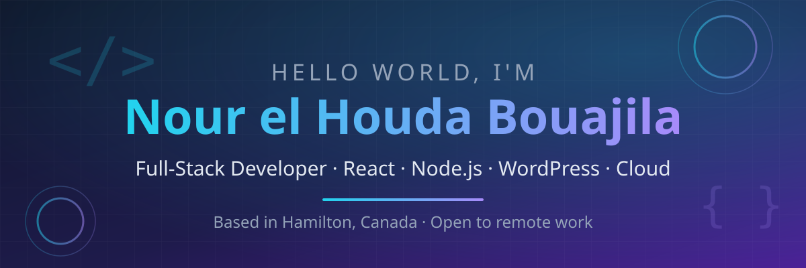
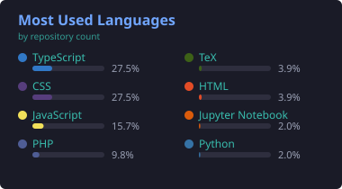

  

  

---

### 👩‍💻 About Me

I'm **Nour el Houda**, a full-stack developer based in **Hamilton, Canada** (originally from Tunisia). I build web applications end to end — from polished frontends to solid backends and cloud deployments.

- 🔭 Currently focused on **web development** — React, Node.js, and WordPress/CMS
- ☁️ Into **DevOps & Cloud**: Docker, Kubernetes, AWS, CI/CD pipelines
- 🤖 Exploring **AI agents** and applied machine learning
- 🌍 Trilingual: Arabic (native), French (advanced), English (professional)
- 📫 Reach me at **nourhb58@gmail.com**

---

### 🛠️ Tech Stack

  
  
  
  
  
  
  
  
  
  
  
  
  
  
  
  
  
  

---

### 🎨 WordPress Block Themes

A collection of **12 production-ready WordPress block themes** (Full Site Editing) — each with 8 templates, 10 block patterns, style variations, and real photography.

| Theme | Niche | variation |
|---|---|---|
| [Forge](https://github.com/nourhb/forge-fitness-theme) | Gym & Fitness | Ice |
| [Haven](https://github.com/nourhb/haven-realestate-theme) | Real Estate | Coastal |
| [Ever After](https://github.com/nourhb/everafter-wedding-theme) | Wedding Planner | Midnight |
| [Ember](https://github.com/nourhb/ember-coffeeshop-theme) | Coffee Shop | Matcha |
| [Saffron](https://github.com/nourhb/saffron-restaurant-theme) | Restaurant | Brunch |
| [Serene](https://github.com/nourhb/serene-spa-theme) | Spa & Wellness | Twilight |
| [Lumina](https://github.com/nourhb/lumina-laser-theme) | Laser Clinic | Noir |
| [Maqss](https://github.com/nourhb/maqss-barbershop-theme) | Barbershop | — |
| [Bloom](https://github.com/nourhb/bloom-kindergarten-theme) | Kindergarten | — |
| [Nexus](https://github.com/nourhb/nexus-gaming-theme) | Gaming | — |
| [Noura](https://github.com/nourhb/noura-wp-theme) | Portfolio/Agency | Midnight, Sahara |
| [Yasmina](https://github.com/nourhb/yasmina-wp-theme) | Beauty Salon | Noir |

### 📊 GitHub Stats

  
  

  

---

### 🐍 Contribution Snake

  

---

### 🤝 Let's Connect

  
  
  

  

